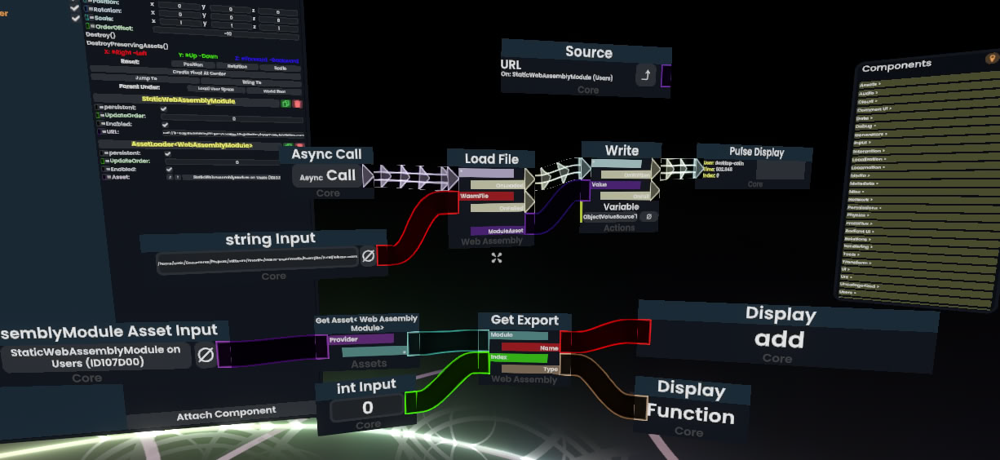

# FrooxEngine WebAssembly Experiments

This plugin provides experimental WebAssembly support for Resonite.



## Build Tools

This project is using [ILRepack](https://www.nuget.org/packages/ILRepack/) for building a combined DLL.
To install it, run:

```bash
dotnet tool restore
```

## Why I'm making this

While WebAssembly is something Resonite might investigate implementing into
the game officially at some point in the future, it's not a priority.
My goal with this plugin is to explore how WebAssembly could be integrated
into the game. Perhaps it could be helpful once this is worked on
officially.
